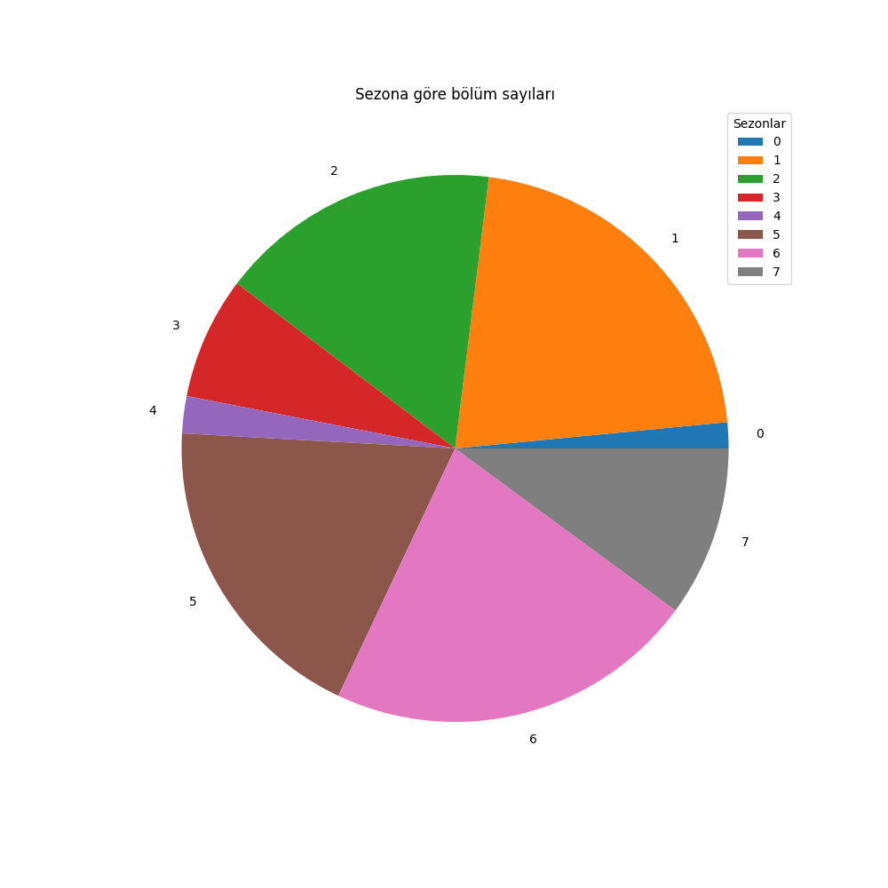

# CreateDataset
## web scraping and data cleaning for machine learning

Amaç, Selenium'a adapte olup, örnek bir veri çekmek ve çekilen veriden özellikler oluşturmak idi. Bir eğitim projesi olarak yapıldı. İlk gerçek kişisel veri çekme projesi olduğu için yanlış kararlar ve hatalar ve gereksiz kodlar olabilir. Ancak çalışan ve video analizinde kullanılabilecek basit bir veri oluşturdum. 

 1. scraper.py ile veriler çekildi.
 2. data_cleaning.ipynb ile veri işlendi.
 3. data_analysis ile de basit veri analizi ve bir kaç grafik çizdirildi.

